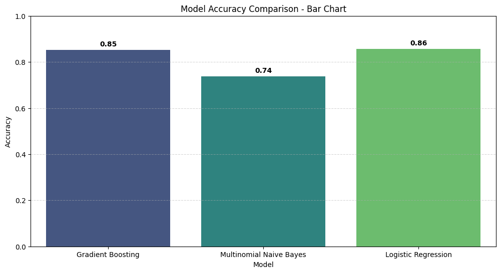

# 📰 Deep Learning News Classification

This repository contains a complete, reproducible workflow to build a **news article classifier** using deep learning and NLP. The model classifies news *headline + short description* into one of several categories using **Universal Sentence Encoder** embeddings and TensorFlow/Keras.

---

## 🔎 Project Summary

Manual categorization of news is slow and error-prone. This project demonstrates a practical pipeline to preprocess news text, convert it into semantic embeddings, train a neural network classifier, and run inference — all reproducible from a Jupyter notebook or standalone scripts.

**Filtered categories used in this project:** `SCIENCE`, `SPORTS`, `TECH`, `BUSINESS`, `EDUCATION`.

---

## ✅ What's included

* `DeepLearning_News_Classification.ipynb` — the main notebook (analysis, experiments, visualizations)
* This `README.md` — setup and runnable code snippets
* Instructions to run training, evaluation, saving and inference

---

## 📥 Dataset

Place the dataset file in the repository root:

* `News_Category_Dataset_v3.json` — (HuffPost news dataset, JSON lines format)

You can get it from Kaggle: *News Category Dataset* (search for `rmisra/news-category-dataset`).

Load it with:

```python
import pandas as pd
df = pd.read_json('News_Category_Dataset_v3.json', lines=True)
```

---

# 🚀 Quick start — step-by-step (copy & run)

### 1) Create a virtual environment and install dependencies

```bash
python -m venv venv
source venv/bin/activate    # macOS / Linux
venv\Scripts\activate     # Windows
pip install -r requirements.txt
```

**`requirements.txt`** (add this file to your repo):

```
tensorflow>=2.12.0
tensorflow-hub
pandas
numpy
scikit-learn
matplotlib
jupyterlab
```

> If you have a GPU and want GPU-accelerated TensorFlow, install the appropriate TensorFlow GPU wheel for your system.

---

### 2) Preprocessing (script / notebook snippet)

```python
# data_prep.py (snippet)
import pandas as pd
from sklearn.preprocessing import LabelEncoder
from sklearn.model_selection import train_test_split

# 1. Load dataset
df = pd.read_json('News_Category_Dataset_v3.json', lines=True)

# 2. Select & clean columns
df = df[['headline', 'short_description', 'category']].dropna()

# 3. Combine headline + description
df['text'] = df['headline'].str.strip() + '. ' + df['short_description'].str.strip()

# 4. Filter categories
selected = ['SCIENCE', 'SPORTS', 'TECH', 'BUSINESS', 'EDUCATION']
df = df[df['category'].isin(selected)]

# 5. Balance (optional) — undersample to the smallest class size for simpler training
min_count = df['category'].value_counts().min()
balanced = df.groupby('category').sample(n=min_count, random_state=42)

# 6. Encode labels
le = LabelEncoder()
balanced['label'] = le.fit_transform(balanced['category'])

# 7. Train-test split
X = balanced['text'].values
y = balanced['label'].values
X_train, X_test, y_train, y_test = train_test_split(X, y, test_size=0.2, stratify=y, random_state=42)

# Save label classes for inference
import json
with open('label_classes.json', 'w') as f:
    json.dump(list(le.classes_), f)

print('Prepared:', X_train.shape, X_test.shape)
```

---

### 3) Model definition & training

```python
# train_model.py (snippet)
import tensorflow as tf
import tensorflow_hub as hub
from tensorflow.keras.callbacks import EarlyStopping, ModelCheckpoint

USE_URL = 'https://tfhub.dev/google/universal-sentence-encoder/4'

def build_model(num_classes):
    # Input is raw text — USE KerasLayer accepts tf.string
    input_text = tf.keras.Input(shape=(), dtype=tf.string, name='text')
    embed = hub.KerasLayer(USE_URL, input_shape=[], dtype=tf.string, trainable=False, name='USE')

    x = embed(input_text)
    x = tf.keras.layers.Dense(256, activation='relu')(x)
    x = tf.keras.layers.Dropout(0.3)(x)
    x = tf.keras.layers.Dense(128, activation='relu')(x)
    x = tf.keras.layers.Dropout(0.2)(x)
    outputs = tf.keras.layers.Dense(num_classes, activation='softmax')(x)

    model = tf.keras.Model(inputs=input_text, outputs=outputs)
    model.compile(optimizer='adam', loss='sparse_categorical_crossentropy', metrics=['accuracy'])
    return model

# Example usage
# num_classes = len(le.classes_)
# model = build_model(num_classes)
# model.summary()

# Train (assuming X_train, y_train, X_test, y_test are loaded as numpy arrays)
# callbacks = [EarlyStopping(monitor='val_loss', patience=3, restore_best_weights=True),
#              ModelCheckpoint('best_news_classifier.h5', save_best_only=True, monitor='val_loss')]
# history = model.fit(X_train, y_train, validation_data=(X_test, y_test), epochs=10, batch_size=32, callbacks=callbacks)
```

**Notes:**

* We use the Universal Sentence Encoder (USE) which maps text to a 512-d vector. The `hub.KerasLayer` can accept raw strings directly — this keeps the pipeline simple.
* `trainable=False` keeps the encoder weights frozen (faster training). You can set `trainable=True` for fine-tuning but that requires more compute.

---

### 4) Evaluate & visualize

```python
# evaluate.py (snippet)
import numpy as np
from sklearn.metrics import classification_report, confusion_matrix

# Load best model
# model = tf.keras.models.load_model('best_news_classifier.h5', custom_objects={'KerasLayer': hub.KerasLayer})

# Predict
# preds = model.predict(X_test)
# y_pred = np.argmax(preds, axis=1)

# Print classification report
# print(classification_report(y_test, y_pred, target_names=le.classes_))

# Confusion matrix
# cm = confusion_matrix(y_test, y_pred)
# print(cm)
```

Add visualization (matplotlib) to plot training curves and confusion matrix in the notebook.

---

### 5) Save model & label mapping

```python
# Save TensorFlow SavedModel
model.save('news_classifier_savedmodel')

# Save label classes (if not already saved)
import json
with open('label_classes.json', 'w') as f:
    json.dump(list(le.classes_), f)
```

Load later with:

```python
import tensorflow_hub as hub
import tensorflow as tf
import json

model = tf.keras.models.load_model('news_classifier_savedmodel', custom_objects={'KerasLayer': hub.KerasLayer})
with open('label_classes.json') as f:
    label_classes = json.load(f)
```

---

### 6) Inference — quick test script

Create a file `predict_sample.py`:

```python
# predict_sample.py
import json
import numpy as np
import tensorflow as tf
import tensorflow_hub as hub

MODEL_PATH = 'news_classifier_savedmodel'
LABEL_PATH = 'label_classes.json'

model = tf.keras.models.load_model(MODEL_PATH, custom_objects={'KerasLayer': hub.KerasLayer})
with open(LABEL_PATH) as f:
    label_classes = json.load(f)

def predict_texts(texts):
    preds = model.predict(np.array(texts))
    classes = np.argmax(preds, axis=1)
    return [label_classes[i] for i in classes]

if __name__ == '__main__':
    samples = [
        'New breakthrough in quantum computing promises faster calculations.',
        'The local team won the championship after a thrilling final match.',
        'A startup launches a new AI-powered developer tool.'
    ]
    results = predict_texts(samples)
    for t, r in zip(samples, results):
        print(f'INPUT: {t}\nPREDICTED: {r}\n')
```

Run with:

```bash
python predict_sample.py
```

Expected output: three predicted categories (e.g. `SCIENCE`, `SPORTS`, `TECH`) — results depend on model and training.
---

Deferent models Result
---

Performance with deferent models 



---

## 📌 Tips & Best Practices

* If training is slow, try training on a subset of data first to ensure the code runs end-to-end.
* Monitor `val_loss` and `val_accuracy` to avoid overfitting.
* Consider using class weighting or oversampling if you decide not to undersample classes.
* For stronger baselines, experiment with Transformer-based models (BERT, DistilBERT) using `transformers` library.

---

## 🧪 Reproducibility

* Set `random_state=42` where applicable
* Save the trained model and label mapping together — this makes deployment and testing straightforward.

---

## 🤝 Contributing

Contributions and improvements are very welcome. Please open an issue or submit a pull request with clear descriptions and tests.

---

## 📜 License

MIT License — feel free to reuse and adapt for research and educational purposes.

---

If you want, I can also create the following files in the repo for you now:

* `requirements.txt`
* `data_prep.py`
* `train_model.py`
* `evaluate.py`
* `predict_sample.py`

Which ones would you like me to generate next?
